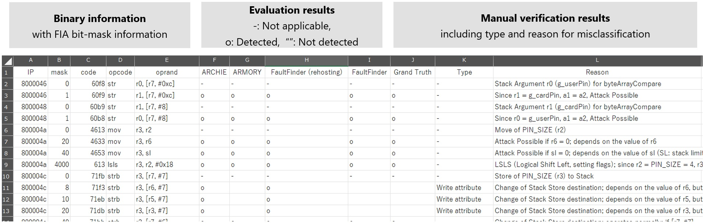

# FIVBinBench

[日本語版の README はこちらこちら](./README-ja.md)。

A Binary-Level Benchmark Dataset for Fault Injection Vulnerability Detection  
Pronunciation: **/ˈfaɪvɪnbɛntʃ/** ("faiv-in-bench") or **/ˈfɪvɪnbɛntʃ/** ("fiv-in-bench")

## Overview

FIVBinBench is a benchmark dataset for evaluating binary-level Fault Injection Attack (FIA) vulnerability detection tools (hereafter called **FVD** tools). This dataset is constructed by running open-source FVD tools on binaries for multiple architectures, collecting ground-truth vulnerability labels through manual verification. The target application is VerifyPIN from the [FISSC](https://lazart.gricad-pages.univ-grenoble-alpes.fr/fissc/) (Fault Injection and Simulation Secure Collection) project.

This repository provides the FVD dataset along with the FVD tools, configuration files, and analysis scripts used to generate it.

### FVD Tools and Target Architectures

| Tool                      | ARMv7m | ARMv7a | x86 |
|---------------------------|--------|--------|-----|
| FaultFinder               | &check;  | &check; | &check; |
| Archie                    | &check;  | - | -|
| Armory                    | &check;  | - | - |
| ChaosDuck                 | - | &check; |&check; |
| FaultArm                  | - | &check;| &check;|
| FaultInjectionSimulator   | - | - |&check; |
| fault-injection-simulation| &check; | &check; | - |

**Note:** In the dataset and scripts, ARMv7a is referred to as "PIE" (Position Independent Executable).

## Package Contents

| Directory       | Contents                                     |  License           |
| --------------- | --------------------------------------- | ---------------------- |
| `dataset/`      | Ground-truth vulnerability dataset          | Per-directory     |
| ┃  `binary/`    | Evaluation binaries                    | GNU LGPLv3 (from FISSC) |
| ┃  `asm/`       | Assembly for evaluation (used only by FaultArm) | GNU LGPLv3 (from FISSC) |
| ┃  `result/`    | Ground-truth vulnerability list (TSV format)        | Mitsubishi License  |
| ┗  `build/`     | Build settings for binary/asm creation      | Mitsubishi License  |
| `eval_scripts/` | Evaluation scripts and configuration files     | Mitsubishi License   |
| `tools/`        | FVD tool collection (submodules)               | According to each tool   |

See the README in each directory for details.

**Note on dataset/binary:**
In addition to `elf` and `map` files, there is `*_gdb.bin` files, which are the target binary for FaultFinder, dumped after running to `main()` with GDB. This is a key part of the "rehosting" technique (see the [Publication and Citation](#publication-and-citation) section for details).

## Ground-Truth Vulnerability List

The ground-truth vulnerability list is shown below, as an example for the 1-bit-flip model on ARMv7m.
Results are provided for instruction skip (IS) model, bit-flip-instruction (BFI) model, and bit-flip-register (BFR) model.



Descriptions for each field (including other fault models):

- Binary information  
  - IP: Instruction Pointer (address)
  - code: Machine code
  - opcode: Opcode
  - operand: Operand
  - mask: Bit-flip mask value (0 = normal)
  - reg: Bit-flip mask value for registers (blank = normal)
- Evaluation result
  - Vulnerability detection results for each tool
- Manual verification result
  - Ground Truth: Ground-truth labels from manual verification
  - Type: Type of misclassification (false positive/negative) and its reason (see [Publication and Citation](#publication-and-citation) for details)
  - Reason: Interpretation of fault impact and rationale for tool result


## How to Run

You can reproduce the dataset creation process by running the FVD tools as follows.

### Test Environment

The following environment was used for validation in the publication (not a strict requirement):

| Item   | Version/Note             |
| ------ | ------------------------ |
| OS     | Windows 11 (22H2) |
| Linux  | Ubuntu 24.04.1 (WSL2)    |
| CPU    | Intel Core i5-8500 (6 cores) |
| RAM    | 56GB                     |
| gcc    | 13.3.0                   |
| Python | 3.12.3                  |


### Usage

1. Clone the repository (with submodules):
   ```sh
   git clone --recurse-submodules https://github.com/pyth0n14n/FIVBinBench.git
   ```
2. Build/install necessary tools:
   See the README under each `tools/` directory.
3. Use dataset and evaluation scripts:
   Move scripts from `eval_scripts/` to each relevant tool directory as needed.
4. Run vulnerability detection with the tools:
   Use the binaries in `dataset/binary` as targets.
5. Integrate the results:
   Output formats differ among tools; aggregate by IP and fault model to match the `dataset/result` files.

### Example: FaultFinder (with Rehosting)

An example result with FaultFinder (using rehosting):

- In "Print Stats", memory state is set for each address — this is the data migration enabled by rehosting.
- 16 instruction skip vulnerabilities are identified.

```sh
$ ./run_fault_finder.sh v7m fault-is
~~~ Run details  ~~~~~~~~~~~~~~~~~~~~~~~~~~~~~~~~~~~~~~~
 >> json filename:          eval/v7m/jsons/binary-details.json
 >> run mode:               fault
...

~~~ FAULTS TO EMULATE  ~~~~~~~~~~~~~~~~~~~~~~~~~~~~~~~~~~~~~~~
Fault: 4-200
  Instruction Pointer 
...

~~~~~~~~~~~~~~~~~~ Print Stats  ~~~~~~~~~~~~~~~~~~~~~~
 >> Binary file under test:      eval/bins/verifypin_0_arm_v7m.bin
 >> Input 0 at address: 0x0 provided:  00200020a9010008000000000...
 >> Input 1 at address: 0x40003808 provided:  0a0000000000000007000...
 >> Input 2 at address: 0x40004400 provided:  c0
...

#extracted: 16
Extracted Fault Addresses: 16
0x800004c  : InstructionPointer SKIP  
0x800004e  : InstructionPointer SKIP  
0x800005c  : InstructionPointer SKIP  
0x8000068  : InstructionPointer SKIP  
0x800006a  : InstructionPointer SKIP  
0x8000072  : InstructionPointer SKIP  
0x8000074  : InstructionPointer SKIP  
0x8000076  : InstructionPointer SKIP  
0x8000078  : InstructionPointer SKIP  
0x800009a  : InstructionPointer SKIP  
0x80000a8  : InstructionPointer SKIP  
0x8000118  : InstructionPointer SKIP  
0x8000124  : InstructionPointer SKIP  
0x800012e  : InstructionPointer SKIP  
0x800013a  : InstructionPointer SKIP  
0x8000162  : InstructionPointer SKIP  
```

## Publication and Citation

If you refer to this dataset and repository in academic work, please cite as follows:
```bibtex
@misc{nashimoto2025fivbinbench,
  author = {Nashimoto, Shoei},
  title = {{FIVBinBench: A Binary-Level Benchmark Dataset for Fault Injection Vulnerability Detection}},
  howpublished = {\url{https://github.com/pyth0n14n/FIVBinBench}},
  year = {2025}
}

@inproceedings{nashimoto2025improved,
  author = {Nashimoto, Shoei},
  title = {{Improving Fault Vulnerability Detection via Rehosting and Comparative Analysis of Open-Source Tools}},
  booktitle={2025 Workshop on Fault Detection and Tolerance in Cryptography (FDTC)},
  volume={},
  number={},
  pages={23-34},
  year = {2025},
  doi={10.1109/FDTC68360.2025.00011}
}
```

